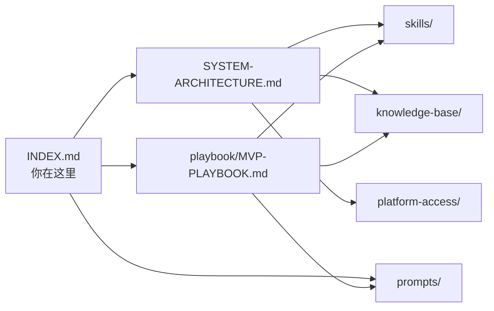

# 📑 文档索引 — 渐进式披露

> 按你当前的需求阶段选择入口。不必一次读完所有文档。

---

## Level 0：我想快速开始

| 你想做什么 | 去哪里 |
|-----------|--------|
| 采集本周热点选题 | → [热点采集提示词](./prompts/widesearch-hot-topics.md) |
| 找到值得对标的创作者 | → [对标分析提示词](./prompts/widesearch-creator-analysis.md) |
| 快速写一个脚本 | → [script-writer Skill](./skills/script-writer/SKILL-SPEC.md) |
| 检查内容是否合规 | → [content-risk-scanner Skill](./skills/content-risk-scanner/SKILL-SPEC.md) |

---

## Level 1：我想理解系统全貌

| 文档 | 内容 | 阅读时间 |
|------|------|---------|
| [SYSTEM-ARCHITECTURE.md](./SYSTEM-ARCHITECTURE.md) | 系统架构 + 9大模块 + Agent分工 | ~15分钟 |
| [KB-DESIGN.md](./knowledge-base/KB-DESIGN.md) | 知识库方案（Ima+飞书） | ~8分钟 |
| [PLATFORM-ACCESS-GUIDE.md](./platform-access/PLATFORM-ACCESS-GUIDE.md) | 平台权限申请指南 | ~5分钟 |

---

## Level 2：我想执行MVP验证

| 步骤 | 文档 | 说明 |
|------|------|------|
| Week 1-2 | [MVP-PLAYBOOK.md](./playbook/MVP-PLAYBOOK.md) | Manus手动采集 + 结果验证 |
| Week 3-4 | `skills/` 各Skill的 SKILL-SPEC.md | 开发Antigravity Skills |
| Week 5-6 | MVP-PLAYBOOK.md Phase 3 | 全流程跑通验证 |

---

## Level 3：我想深入定制

| 需求 | 文档 |
|------|------|
| 自定义飞书多维表格结构 | → [schemas/](./knowledge-base/schemas/) |
| 自定义Ima知识库模板 | → [templates/](./knowledge-base/templates/) |
| 开发新的Skill | → 参考 `skills/` 下的 SKILL-SPEC.md 格式 |
| 调整提示词参数 | → 直接编辑 `prompts/` 下的提示词文件 |

---

## 文档依赖关系

